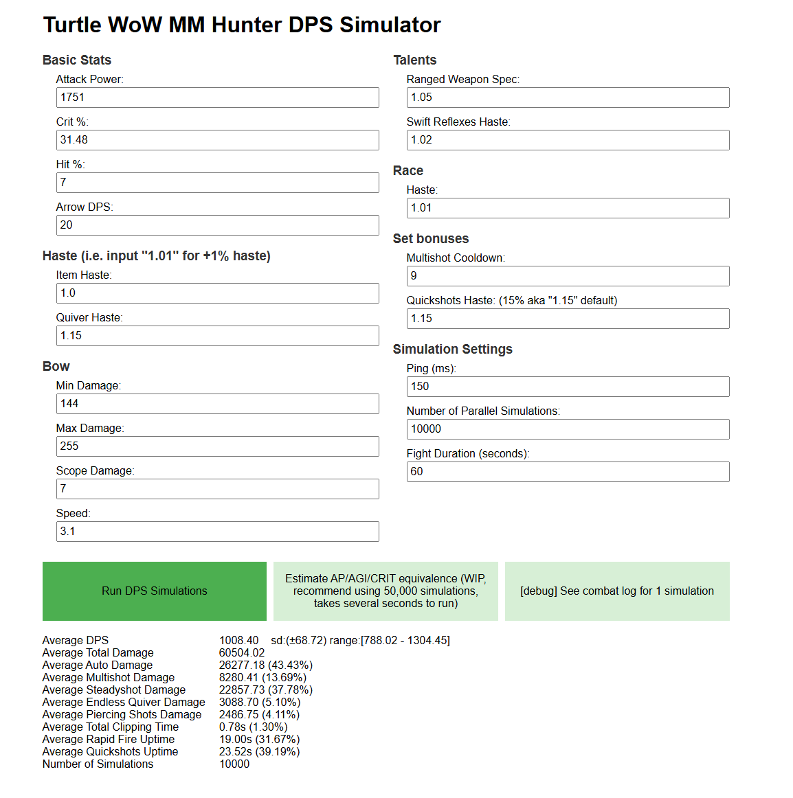
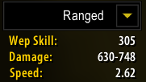
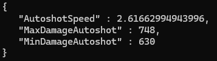
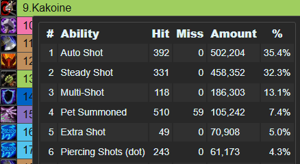
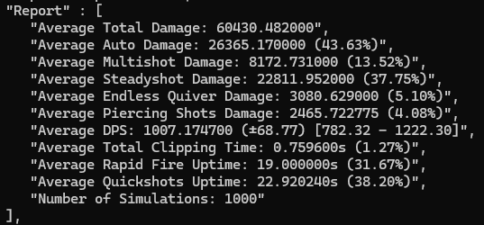

# (WIP) TurtleWoW Marksman Hunter DPS Simulator

This is a basic API that accepts a hunter's stats (AP, Crit, etc) and returns simulated DPS output. 

This is still very early in development and only has a basic form to input stats, later on you will be able to add your gear/talents/etc.

## How do I use it?
This is not currently deployed, you have to run it locally to test.

### To run locally (Windows):
* I recommend installing [Windows Subsystem For Linux](https://learn.microsoft.com/en-us/windows/wsl/install) by running this in your terminal:
    ```
    wsl --install
    ```
then open the WSL terminal and follow the steps below

### To run locally (linux/mac os/windows WSL):
* Clone or download this repository

* Install Go 1.21 or later:
  * **Linux**: Download from [golang.org/dl](https://golang.org/dl/) or use your package manager:
    ```bash
    # Ubuntu/Debian/Windows WSL
    sudo apt update
    sudo apt install golang-go
    ```
  * Verify installation:
    ```bash
    go version
    ```

* Run the simulator in a terminal window (make sure to `cd` into the `hunter-sim` folder first):
  ```bash
  make run
  ```

* Open your web browser and go to `http://localhost:8080`
* Fill in your hunter's stats in the form and click "Run Simulation"
* The results will be displayed below the form


## How does it work?
The simulator tries to emulate game logic as closely as possible. It steps through a game loop every 10ms (`clock.go`) and follows a typical hunter autoshot, steadyshot, multishot,  weaving rotation, queued by `actionqueue.go`. Randomized damage, based on real 1.12.1 ranged attack formulas, is calculated in `hunter.go`.

To check accuracy, three things were done:
* I compared calculated autoshot damage range and attack speed to damage range in in-game character panel (check out `hunter_test.go`)




* I compared calculated multishot and steadyshot damage ranges to actual damage from hitting the level 1 dummy for very long time
* I compared general damage share from each ability to actual raid logs to make sure skill damage percentages were similar (keep in mind, the sim doesn't have pet damage, so numbers will be slightly different with similar ratios):





## TODO list:
* build frontend to select gear, calculate base stats, send sim request to API, and display results
* implement trinket swapping logic and allow passing in special inputs such as trinket rotation
* implement optional armor setting (currently, armor/mob level is not taken into account)
* allow passing in different rotations (i.e. [auto - steady - multi - auto], [auto - multi - auto - steady], or a mix of the two if rapidfire/quickshots is active)
* A / B testing - i.e. pass in 2 sets of gear and see the difference in dps with one request
* implement pet DPS simulation (maybe, kind of a pain for little benefit)
